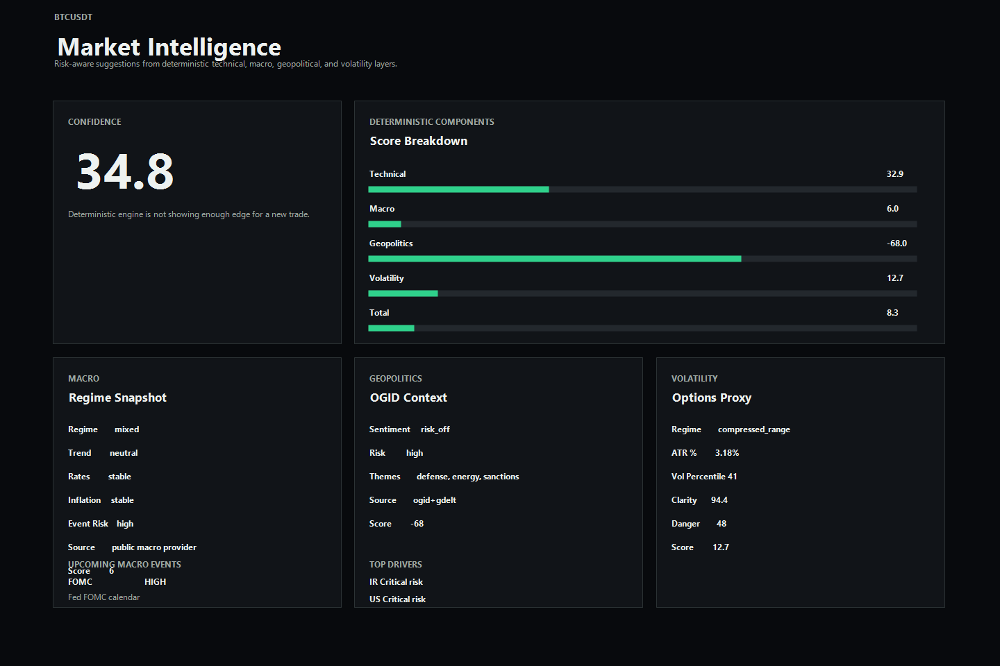

# btc-risk-dashboard

`btc-risk-dashboard` is a deterministic-first market intelligence and risk-aware trade suggestion dashboard. It started as a BTC-only "should I trade now?" tool and now layers technical, macro, geopolitical, volatility, knowledge-base, watchlist, and optional LLM meta reasoning for multiple tradeable assets.

It is not an oracle. It does not predict price, guarantee accuracy, or promise profitable trades. The goal is to improve risk-adjusted decision quality versus an ad hoc retail workflow by making the assumptions, scores, conflicts, data sources, and risk controls explicit.



## Architecture

```text
Historical CSV data
-> parser / normalizer / historical feature engine

Market data
-> Binance crypto adapter
-> Yahoo Finance stock / ETF adapter
-> technical engine

Macro provider
-> deterministic .env fallback
-> optional public FRED indicators
-> optional official BLS / Fed / BEA event calendars

Geopolitics / OSINT
-> optional OGID service
-> optional public GDELT DOC API enrichment

Volatility / options proxy engine
Knowledge JSON rules
-> structured deterministic fusion engine
-> optional OpenAI LLM explanation layer
-> API + dashboard UI
```

The legacy endpoints still work:

```text
GET /api/health
GET /api/dashboard
GET /api/scoring
```

Current endpoints:

```text
GET    /api/analysis?symbol=BTCUSDT&interval=1h
GET    /api/analysis/multi-timeframe?symbol=BTCUSDT
GET    /api/assets
GET    /api/assets/resolve?symbol=SPY
POST   /api/assets/watchlist
DELETE /api/assets/watchlist/:symbol
GET    /api/macro/snapshot
GET    /api/geopolitics/snapshot?symbol=BTCUSDT
GET    /api/knowledge/summary
POST   /api/knowledge/import-pdf
POST   /api/knowledge/import-directory
```

Supported intervals:

```text
1m, 5m, 15m, 30m, 1h, 4h, 1d
```

Seeded assets:

```text
BTCUSDT, ETHUSDT, AAPL, SPY, GLD, TLT
```

## Requirements

- Node.js 20.16+ recommended
- npm
- Optional FRED API key for live public macro indicators
- Optional local or remote OGID service for geopolitical intelligence
- Optional GDELT public OSINT enrichment
- Optional OpenAI API key for the meta explanation layer

`pdf-parse` requires Node 20.16+ or 22.3+. The deterministic API and tests can still run without importing PDFs, but PDF import should use Node 20+.

## Setup

```bash
npm install
```

Create `.env` from `.env.example` and set only the providers you use. Do not put secrets in source files.

Core app and market variables:

```bash
PORT=3000
NODE_ENV=development

BINANCE_BASE_URL=https://api.binance.com
YAHOO_FINANCE_BASE_URL=https://query1.finance.yahoo.com
ASSET_CONFIG_PATH=data/config/watchlist.json
MARKET_SYMBOL=BTCUSDT
MARKET_INTERVAL=1h
MARKET_LIMIT=120
CACHE_TTL_SECONDS=60
```

Macro fallback and public provider variables:

```bash
# Use "fallback" for deterministic .env-only macro state.
# Use "public" for FRED + official calendars with fallback per missing dimension.
MACRO_PROVIDER=public

MACRO_REGIME=mixed
MACRO_INFLATION_TREND=stable
MACRO_RATES_TREND=stable
MACRO_VOLATILITY_REGIME=calm
MACRO_EVENT_RISK=low
MACRO_LIQUIDITY=neutral
MACRO_CACHE_TTL_SECONDS=900

FRED_API_KEY=
FRED_BASE_URL=https://api.stlouisfed.org
MACRO_PROVIDER_TIMEOUT_MS=8000
MACRO_CALENDAR_CACHE_TTL_SECONDS=21600
MACRO_EVENT_LOOKAHEAD_DAYS=30
MACRO_EVENT_HIGH_WINDOW_HOURS=24
MACRO_EVENT_MEDIUM_WINDOW_HOURS=72

BLS_CALENDAR_URL=https://www.bls.gov/schedule/news_release/bls.ics
FED_FOMC_CALENDAR_URL=https://www.federalreserve.gov/monetarypolicy/fomccalendars.htm
BEA_RELEASE_SCHEDULE_URL=https://www.bea.gov/news/schedule

# Optional comma-separated dates that also raise event risk near CPI/FOMC/NFP/GDP events.
MACRO_EVENT_DATES=
```

Geopolitics and OSINT variables:

```bash
OGID_ENABLED=false
OGID_BASE_URL=http://localhost:8080/api
OGID_COUNTRIES=US,IL,IR
OGID_TIMEOUT_MS=8000

GDELT_ENABLED=true
GDELT_BASE_URL=https://api.gdeltproject.org/api/v2
GDELT_TIMESPAN=24h
GDELT_MAX_RECORDS=75
```

Optional provider credentials:

```bash
# Reserved for future premium / secondary macro adapters.
TRADING_ECONOMICS_API_KEY=
BEA_USER_ID=

# Optional OpenAI meta layer. Missing key is safe; deterministic output still works.
OPENAI_API_KEY=
OPENAI_MODEL=gpt-4.1-mini
OPENAI_BASE_URL=
OPENAI_TIMEOUT_MS=8000
```

## Provider Setup

For deterministic-only operation, leave `MACRO_PROVIDER=fallback`. The app will use:

```text
MACRO_REGIME
MACRO_INFLATION_TREND
MACRO_RATES_TREND
MACRO_VOLATILITY_REGIME
MACRO_EVENT_RISK
MACRO_LIQUIDITY
MACRO_EVENT_DATES
```

For public macro operation:

1. Create a free FRED API key.
2. Set `MACRO_PROVIDER=public`.
3. Set `FRED_API_KEY`.
4. Keep fallback values configured. They remain active per missing dimension if FRED or a calendar source fails.
5. Restart the server and check `GET /api/macro/snapshot`.

The public macro provider derives:

```text
inflationTrend     -> CPI / Core CPI YoY and 3-month momentum
ratesTrend         -> Fed Funds / 2Y Treasury movement
volatilityRegime   -> VIX, high-yield spread, NFCI
liquidity          -> WALCL - RRPONTSYD - WTREGEN proxy
eventRisk          -> official event calendars + MACRO_EVENT_DATES + OGID/GDELT
regime             -> risk_on, mixed, risk_off from the derived dimensions
```

Event risk windows:

```text
high   <= MACRO_EVENT_HIGH_WINDOW_HOURS
medium <= MACRO_EVENT_MEDIUM_WINDOW_HOURS
low    otherwise
```

GDELT can enrich geopolitical context and macro event risk even when OGID is disabled. OGID remains the richer source when configured; the UI reports `ogid`, `gdelt`, `ogid+gdelt`, or `fallback`.

## Watchlist

The dashboard loads the asset selector from `/api/assets`. Seeded assets are merged with the local watchlist file at `ASSET_CONFIG_PATH`; if the file does not exist, the app creates it as:

```json
{
  "assets": []
}
```

Dynamic symbols are validated through the configured market provider before they are saved. Crypto pairs such as `SOLUSDT` route to Binance, while stocks and ETFs such as `NVDA` or `SPY` route to Yahoo Finance.

`data/config/watchlist.json` is local runtime state and is ignored by git. `data/config/.gitkeep` keeps the directory available in fresh clones.

## Import Data

Historical trade data is optional for the market intelligence endpoint but still powers the legacy dashboard equity view.

```bash
npm run import:dataset
npm run build:snapshots
```

Generated files:

- `data/processed/trades.json`
- `data/processed/historical-features.json`
- `data/processed/invalid-rows.json`

## Knowledge Pipeline

Seed knowledge lives in:

- `data/knowledge/trading_strategies.json`
- `data/knowledge/macro_rules.json`
- `data/knowledge/volatility_rules.json`
- `data/knowledge/event_rules.json`
- `data/knowledge/regime_rules.json`
- `data/knowledge/risk_rules.json`

Import a local PDF or text file into structured JSON:

```bash
npm run import:knowledge -- /absolute/path/to/file.pdf
npm run knowledge:summary
```

Import all supported files from `KNOWLEDGE_SOURCE_DIR`:

```bash
npm run import:knowledge-dir
npm run import:knowledge-dir -- --force
npm run import:knowledge-dir -- --sourceDir F:\pdfs
npm run import:knowledge-dir -- --dryRun
```

Supported batch source files:

```text
.pdf, .txt, .md, .csv
```

CSV files can provide structured columns such as `category`, `id`, `title`, `condition`, `impact`, `risk_note`, `assetTypes`, `marketRegimes`, `themes`, and `confidenceWeight`. CSVs without known columns are treated as text rows and normalized through the deterministic text pipeline.

The importer works deterministically by chunking text, classifying topics, normalizing rule shapes, deduplicating by id, and preserving source metadata. If `useLlm` is passed and OpenAI is configured, an optional LLM-assisted normalization pass can add concise rule candidates; deterministic extraction remains the primary path.

Batch imports write an incremental source index to `data/knowledge/sources.json`. Unchanged files are skipped unless `--force` is used. The runtime analysis path does not read raw PDFs or CSVs; `/api/analysis` uses the normalized JSON files under `data/knowledge`.

## Run

```bash
npm run dev
```

Open:

```text
http://localhost:3000
```

Useful validation requests:

```text
GET /api/health
GET /api/assets
GET /api/macro/snapshot
GET /api/geopolitics/snapshot?symbol=BTCUSDT
GET /api/analysis?symbol=BTCUSDT&interval=1h
```

## Example Analysis Response

```json
{
  "asset": {
    "symbol": "BTCUSDT",
    "type": "crypto"
  },
  "timeframe": "1h",
  "signal": "WAIT",
  "confidence": 34.8,
  "riskLevel": "high",
  "scores": {
    "technical": 32.9,
    "macro": 6,
    "geopolitics": -68,
    "volatility": 12.7,
    "total": 8.3
  },
  "components": {
    "macro": {
      "provider": "public",
      "source": "public-macro-provider",
      "regime": "mixed",
      "eventRisk": "high",
      "eventRiskSource": "fed-fomc-calendar",
      "indicators": [],
      "events": [],
      "diagnostics": {}
    }
  },
  "knowledgeMatches": [],
  "summary": "WAIT setup with high risk..."
}
```

## Tests

```bash
npm test
```

The suite covers:

- asset registry and watchlist API
- market-data provider routing
- dashboard client API wiring
- historical features and indicator utilities
- technical scoring
- macro fallback scoring
- public macro provider parsing and derivation
- geopolitical scoring with OGID/GDELT-style payloads
- volatility scoring
- fusion thresholds and timeframe alignment
- knowledge matching
- PDF/text knowledge normalization
- LLM fallback behavior

## Provider Notes

- Crypto market data uses Binance klines.
- Stocks, ETFs, and commodity proxies use Yahoo Finance chart data.
- Macro defaults to deterministic `.env` fallback state unless `MACRO_PROVIDER=public`.
- Public macro mode uses FRED observations for inflation, rates, volatility/credit, liquidity, GDP, and labor indicators.
- Official BLS/Fed/BEA calendars provide CPI, NFP, FOMC, and GDP scheduled event risk.
- `MACRO_EVENT_DATES` can manually add high-impact dates and remains useful when live calendars are unavailable.
- OGID is optional and queried through `/api/intel/news`, `/api/intel/insights`, `/api/intel/risks`, `/api/market/impact`, and `/api/market/analytics`.
- GDELT DOC API is optional public OSINT enrichment controlled by `GDELT_ENABLED`.
- Options-chain support is not required yet; the volatility layer uses realized volatility, ATR, percentile, compression, and expansion proxies.

## Troubleshooting

- If `/api/macro/snapshot` returns `source: env-fallback`, check `MACRO_PROVIDER`, `FRED_API_KEY`, network access, and `diagnostics.providerErrors`.
- If the UI shows no upcoming events, check calendar URLs and `MACRO_EVENT_LOOKAHEAD_DAYS`.
- If OpenAI quota or credentials fail, deterministic analysis still works and the LLM panel reports the failure.
- If adding a new asset fails, confirm the symbol exists on Binance for crypto pairs or Yahoo Finance for stocks/ETFs.
